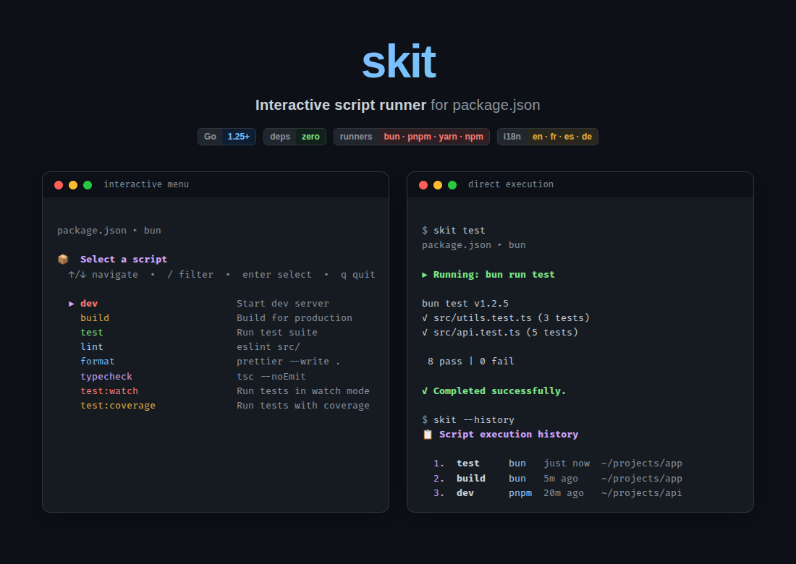
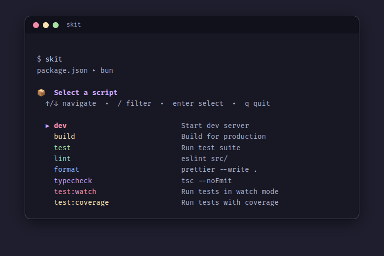
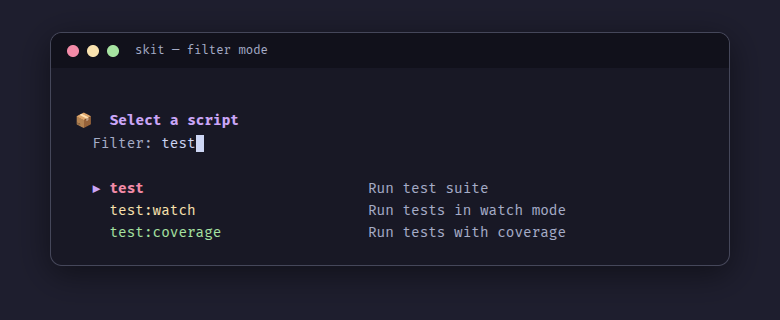
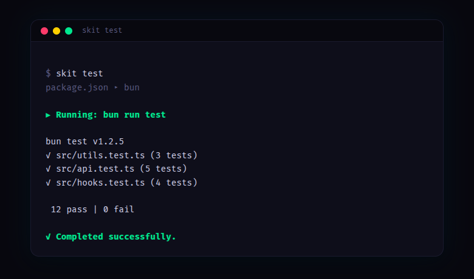
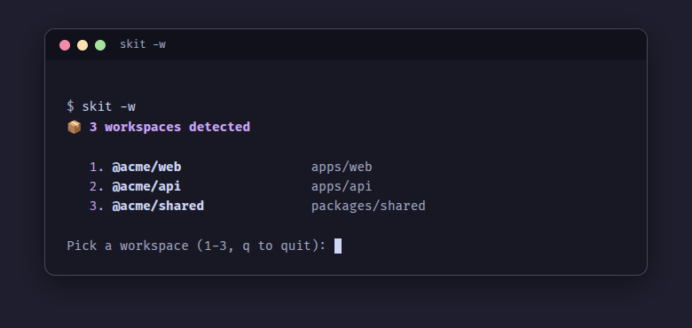
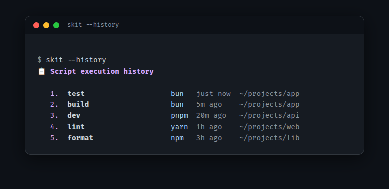
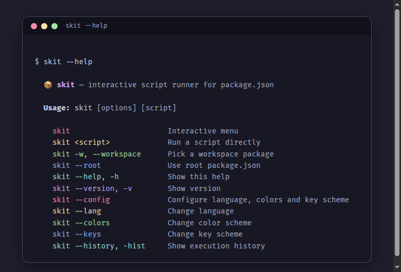

<p align="center">
  
</p>

<p align="center">
  <strong>Browse, filter, and run package.json scripts from an interactive terminal menu.</strong>
</p>

<p align="center">
  <a href="https://github.com/subut0n/skit/actions/workflows/ci.yml"></a>
  <a href="https://github.com/subut0n/skit/releases/latest"></a>
  <a href="LICENSE"></a>
  
</p>

<p align="center">
  <a href="#installation">Installation</a> &middot;
  <a href="#usage">Usage</a> &middot;
  <a href="#features">Features</a> &middot;
  <a href="#configuration">Configuration</a> &middot;
  <a href="#package-json-conventions">Conventions</a> &middot;
  <a href="#building-from-source">Building from Source</a>
</p>

---

## Why skit?

Running `npm run` requires you to remember script names, open `package.json` to check what's available, or rely on tab completion that only shows names without descriptions.

**skit** gives you an interactive, filterable menu that surfaces your scripts with descriptions — pick one with arrow keys and hit Enter. It auto-detects your package manager (bun, pnpm, yarn, npm) and supports monorepo workspaces out of the box.

## Installation

### Quick install (recommended)

```bash
curl -fsSL https://raw.githubusercontent.com/subut0n/skit/main/install.sh | sh
```

Pin a specific version:

```bash
curl -fsSL https://raw.githubusercontent.com/subut0n/skit/main/install.sh | sh -s -- --version v1.0.0
```

<details>
<summary>Other install methods</summary>

### go install

```bash
go install github.com/subut0n/skit@latest
```

### Pre-built binaries

Download the latest release for your platform from the [Releases](https://github.com/subut0n/skit/releases) page, then:

```bash
chmod +x skit-*
sudo mv skit-* /usr/local/bin/skit
```

### From source

Requires **Go 1.25+**.

```bash
git clone https://github.com/subut0n/skit.git && cd skit
make build
sudo mv skit /usr/local/bin/
```

</details>

## Usage

```bash
skit                # Launch the interactive menu
skit <script>       # Run a script directly
skit -w             # Pick a workspace package (monorepo)
skit --root         # Use root package.json
skit --help         # Show help
skit --history      # Show execution history
skit --config       # Full configuration wizard
```

### Interactive menu

Run `skit` with no arguments in any directory containing a `package.json`:

<p align="center">
  
</p>

Navigate with arrow keys (or your configured key scheme), press Enter to execute the selected script.

### Real-time filtering

Press `/` to enter filter mode — type to narrow down scripts by name or description:

<p align="center">
  
</p>

### Direct execution

Pass a script name to skip the menu entirely:

<p align="center">
  
</p>

### Workspace support

In a monorepo, use `-w` to pick which workspace to run scripts from:

<p align="center">
  
</p>

Supports npm, yarn, bun, and pnpm workspace configurations.

### Execution history

View your recent scripts across projects:

<p align="center">
  
</p>

### Help

<p align="center">
  
</p>

## Features

| Feature | Description |
|---------|-------------|
| **Interactive menu** | Browse scripts with arrow key navigation |
| **Real-time filter** | Press `/` to search scripts by name or description |
| **Direct execution** | `skit <script>` for scripting and power users |
| **Auto-detect runner** | Picks bun, pnpm, yarn, or npm from lockfiles |
| **Workspace support** | Monorepo-aware — pick a workspace with `-w` |
| **Execution history** | Last 50 scripts remembered across sessions |
| **First-run wizard** | Guided setup for language, colors, and key scheme |
| **Multi-language UI** | English, French, Spanish, German |
| **Accessibility** | Deuteranopia, tritanopia, and high-contrast color schemes |
| **Custom key bindings** | Arrows, WASD, or any two custom keys |
| **Fallback mode** | Numbered text menu when raw terminal mode is unavailable |
| **Cross-platform** | Linux, macOS |
| **Zero dependencies** | Pure Go standard library — no external packages |

## Configuration

On first run, `skit` launches a setup wizard. You can reconfigure at any time:

```bash
skit --config     # Full setup (language + colors + keys)
skit --lang       # Change language only
skit --colors     # Change color scheme only
skit --keys       # Change key bindings only
```

Configuration is stored in `~/.config/skit/config.json`.

### Color schemes

| Scheme | Description |
|--------|-------------|
| **Rainbow** | Default — full spectrum palette |
| **Deuteranopia** | Optimized for red-green color blindness |
| **Tritanopia** | Optimized for blue-yellow color blindness |
| **High Contrast** | Maximum contrast with bright colors |

### Key schemes

| Scheme | Up / Down | Quit |
|--------|-----------|------|
| **Arrows** (default) | `↑` / `↓` | `q` |
| **WASD** | `w` / `s` | `q` |
| **Custom** | Any two keys | `q` (or `Ctrl+C` if `q` is bound) |

## Package.json Conventions

`skit` reads scripts from the `"scripts"` field and displays them with their command. To add human-readable descriptions, use the `"x-skit"` field:

```json
{
  "scripts": {
    "dev": "next dev",
    "build": "next build",
    "test": "vitest run",
    "test:watch": "vitest"
  },
  "x-skit": {
    "dev": "Start dev server",
    "build": "Build for production",
    "test": "Run test suite",
    "test:watch": "Run tests in watch mode"
  }
}
```

Scripts are grouped by prefix — everything before the first `:` becomes a group. For example, `test`, `test:watch`, and `test:coverage` are grouped under **test**.

### Package manager detection

`skit` auto-detects your package manager from lockfiles, in priority order:

| Lockfile | Runner |
|----------|--------|
| `bun.lockb` / `bun.lock` | `bun run` |
| `pnpm-lock.yaml` | `pnpm run` |
| `yarn.lock` | `yarn run` |
| `package-lock.json` (or fallback) | `npm run` |

## Building from Source

Requires **Go 1.25+**.

```bash
make build                 # Build with version injection
make test                  # Run tests with race detector
make dist                  # Cross-compile for all platforms
make coverage              # Run tests with coverage report
```

## Project Structure

```
skit/
├── main.go                    # Entry point and CLI orchestration
├── internal/
│   ├── ansi/                  # ANSI escape code constants
│   ├── config/                # Persistent configuration (~/.config/skit/)
│   ├── detector/              # Package manager detection (bun > pnpm > yarn > npm)
│   ├── history/               # Execution history tracking
│   ├── i18n/                  # Internationalization (en, fr, es, de)
│   ├── parser/                # package.json script extraction + workspace support
│   └── ui/                    # Interactive terminal menu
└── assets/                    # Screenshots and HTML renders
```

## License

[MIT](LICENSE)
